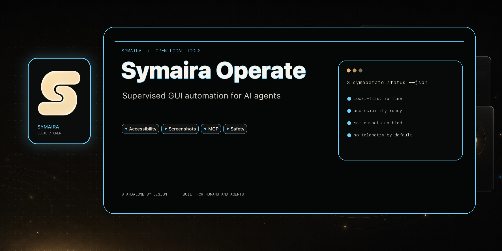

# symaira-operate

> Let an AI agent see and drive your Mac — locally, over MCP.

[](https://github.com/danieljustus/symaira-operate/actions/workflows/ci.yml)
[](https://github.com/danieljustus/symaira-operate/tree/coverage-data)
[](https://github.com/danieljustus/symaira-operate/releases/latest)
[](https://opensource.org/licenses/Apache-2.0)
[](https://swift.org)



`symoperate` is a native macOS desktop-automation **MCP server**. It exposes
screenshots, the Accessibility tree, mouse/keyboard input, and app/window control
over stdio, so an agent (Claude Desktop, OpenCode, Cursor, …) can operate the
GUI: open an app, find a button, click it, type, save. It is a supervised, local
tool — not a remote-control daemon.

Part of the [Symaira](../ECOSYSTEM.md) family, and the agent-native sibling of
[`symaira-tune`](../symaira-tune) (hardware tuning): **operate = GUI actions,
tune = thermals/brightness/power.**

> **Status: v0.5.0.** Working native implementation (rebranded from the author's
> `mac-operator` prototype), 164 tests passing.

## Why symoperate?

- **Local and supervised.** No remote listener, no daemon. The agent sends one
  action at a time over stdio and gets fresh state back.
- **MCP-native.** Works with any MCP host — Claude Desktop, OpenCode, Cursor, …
  — without host-specific plugins.
- **Element-first.** Prefer stable accessibility `element_id`s over brittle
  screen coordinates; re-snapshot after each UI change.
- **Safety-guarded.** Refuses destructive controls and secure text fields; never
  automate passwords or permission dialogs without explicit confirmation.
- **Native macOS.** Built with AppKit, Accessibility, and ScreenCaptureKit for
  reliable performance on macOS 15+.

## Install

**Homebrew (recommended):**

```bash
brew install danieljustus/tap/symoperate
```

**Direct download:** grab the latest `symoperate.dmg` from the
[Releases page](https://github.com/danieljustus/symaira-operate/releases/latest),
open it, and move `symoperate` to `/usr/local/bin/` (or any directory on your
`PATH`).

Then grant permissions and verify the install:

```bash
symoperate permissions grant accessibility
symoperate permissions grant screen
symoperate doctor
```

## Requirements

- macOS 15+
- `Accessibility` and `Screen Recording` permissions for the host process

## Build

```bash
swift build            # binary at .build/debug/symoperate
swift test             # run the test suite
swift run -q symoperate doctor
```

## CLI

```text
symoperate serve                          Run the MCP server over stdio
symoperate doctor                         Permission status + environment probes (JSON)
symoperate version                        Print version and check for updates (JSON)
symoperate history --json                 Print the local operation history (JSON)
symoperate updates check [--force]        Check for updates and print result (JSON)
symoperate updates skip [<version>]       Show skipped version, or skip a specific version
symoperate updates clear-skip             Clear the skipped version
symoperate permissions status             Current macOS permissions
symoperate permissions grant accessibility
symoperate permissions grant screen
```

### Terminal demo

A real first-run of `symoperate doctor` on a machine where the Accessibility
permission is not yet granted — it reports exactly what is missing instead of
failing silently:

```console
$ symoperate doctor
{
  "capabilities" : {
    "accessibility" : false,
    "multi_display" : false,
    "ocr" : true,
    "screenshot" : true
  },
  "environment" : {
    "appsCount" : 8,
    "displaysCount" : 1,
    "macOSVersion" : "27.0.0",
    "platform" : "macOS",
    "swiftVersion" : "unknown"
  },
  "ok" : false,
  "permissions" : {
    "accessibilityGranted" : false,
    "screenRecordingGranted" : true,
    "source" : {
      "executablePath" : "/path/to/symoperate",
      "note" : "These booleans describe the TCC grants held by the process identified above. On macOS, TCC permissions (Accessibility, Screen Recording) are per-process — granting them to the launching app (e.g., Terminal, Cursor) does NOT make them available to the MCP host that launched symoperate. Grant permissions from the process that will actually be using symoperate's MCP server.",
      "pid" : 30337,
      "ppid" : 30303
    }
  },
  "recommendations" : [
    "Accessibility permission denied."
  ],
  "version" : "0.5.0"
}
```

Grant the missing permissions (`symoperate permissions grant accessibility`)
and re-run `doctor` — `ok` flips to `true` once every capability is available.
(`executablePath`/`pid` above reflect the machine the output was captured on.)

## MCP tools

`snapshot`, `query_ui`, `query_ui_ocr`, `find_ui`, `list_apps`, `list_windows`,
`list_displays`, `click`, `type_text`, `press_keys`, `scroll`, `drag`,
`launch_app`, `focus_window`, `menu_action`, `wait_for`, `permissions_status`,
`get_policy`, `set_policy`, `version`.

Register with an MCP host:

```json
{ "mcpServers": { "symoperate": { "command": "/abs/path/symoperate", "args": ["serve"] } } }
```

### Recommended agent loop

1. `query_ui` (or `snapshot`) → 2. decide → 3. prefer `element_id` over raw
coordinates → 4. one action → 5. re-snapshot before the next step.

## Safety

Supervised, local, stdio-only. Destructive controls (Delete/Trash/Uninstall/
Allow/Authorize/Unlock/Quit/…) and secure text fields are refused for
element-based actions. Don't automate passwords, payments, or permission dialogs
without explicit user confirmation. See [AGENTS.md](AGENTS.md), [SAFETY_AUDIT.md](SAFETY_AUDIT.md), and `NOTICE`.

## Documentation

- [docs/architecture.md](docs/architecture.md) — components & tool contract
- [docs/roadmap.md](docs/roadmap.md) — built vs planned

## License

Apache-2.0 © 2026 Daniel Justus.
